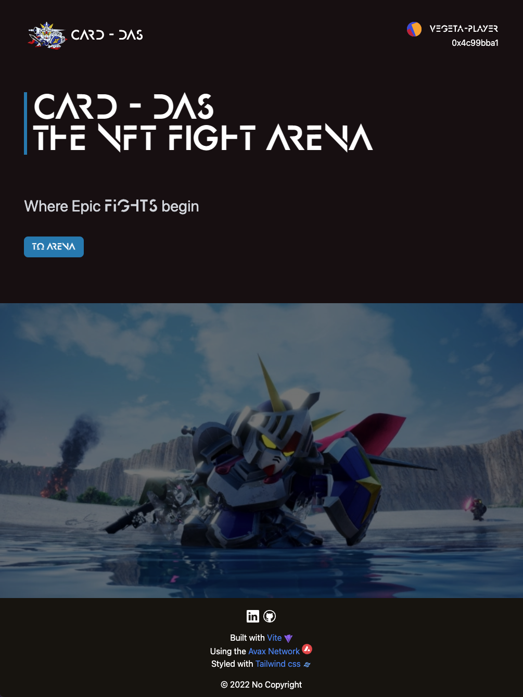

# Card Das - The NFT Card Gladiators Colyseum



## Motivation

Trying to build a [Card-dass](https://en.wikipedia.org/wiki/Carddass) online battle platform that uses the [avax network](https://www.avax.network/) to set epic card fights in marble stone.

## Tools

- project scaffolded using [vite](https://vitejs.dev/) 
- written in [typescript](https://www.typescriptlang.org/) 
- using [reactjs](https://reactjs.org/) library 
- [tailwindcss](https://tailwindcss.com) for the style 
- [avax network](https://www.avax.network/) to deploy the smart contractt 

## Prerequisites to use the web-app

Having at least one of the wallet extension installed

- [metamask](https://metamask.io/)
- [core](https://core.app/)
- [coinbase](https://www.coinbase.com/)
- [walletconnect](https://walletconnect.com/)

And add the fuji `test` network to the list of your network: how to [here](https://api.avax-test.network/ext/bc/C/rpc)

## Features

1. Create a player
2. Create or join an Arena
3. Start The fight
4. Enjoy the victory or your oponent's


## Clone it and run it locally

### Getting started

Go the app folder

```shell
$ cd app
```

Install the dependencies

```shell
$ npm i
```

Finally run the app locally

```shell
$ npm run dev
```

#### A snippet for snack:


